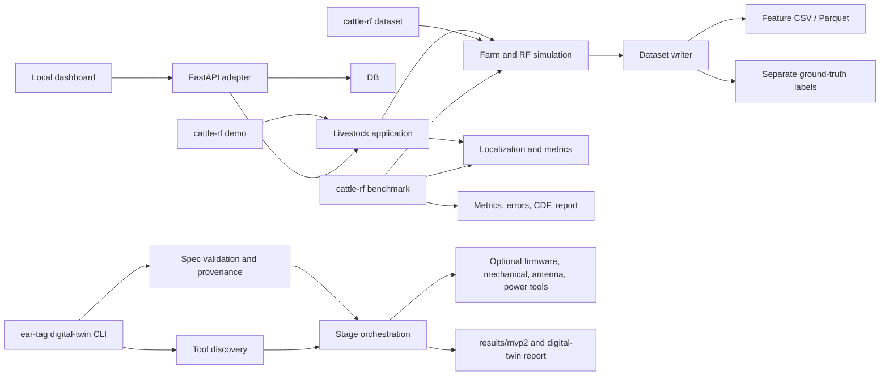

# Architecture and growth plan

## Current system

This repository contains two product areas that share a livestock-tracking
theme but have different runtimes and evidence boundaries:

```text
users
  ├─ cattle-rf CLI / FastAPI dashboard
  │    ├─ src/riose/products/livestock_tracking/ # canonical MVP1 implementation
  │    └─ src/cattle_rf/                 # legacy import facades
  └─ python -m riose.products.ear_tag.digital_twin # MVP2 analysis workflow
       └─ src/riose/products/ear_tag/digital_twin/ # canonical package
          └─ src/riose/digital_twin/     # compatibility facade

hardware/                                # embedded and engineering workspace
  ├─ firmware, models, antenna, mechanical, spice, physical,
  │  renode, kicad, reports, spec.yaml, tests

datasets/, results/, docs/               # generated evidence and documentation
tests/{livestock_tracking,ear_tag}/       # product-focused Python tests
```

Canonical Python product implementations now live under `src/riose/products/`.
The hardware workspace remains at its existing top-level paths in this
migration. The `cattle_rf.*` and `riose.digital_twin` paths remain Python
compatibility interfaces.

## Product organization

The product roots below are the canonical homes for new and existing code.
Shared code should move into a shared package only when at least two products
need the same stable capability. Livestock entities and RF contracts remain
inside livestock tracking.

```text
src/riose/
  products/
    livestock_tracking/
      domain/                            # animal, farm, RF contracts and rules
      simulation/                        # farm, RF, episode generation
      localization/                      # estimators and metrics
      application/                       # use cases/pipelines
      adapters/
        api.py                           # FastAPI routes and dashboard composition
        persistence/                     # SQLite implementation
        datasets/                        # CSV/Parquet serialization
      firmware/                          # virtual tag state/energy model
      cli.py                             # command composition only
    ear_tag/
      digital_twin/                      # spec, readiness gate, orchestration
      signal/                            # offline XYZ validation and features
    <future_product>/                    # independent domain and adapters

hardware/
  firmware/, models/, antenna/, mechanical/, spice/, renode/, physical/ # ear tag

tests/{livestock_tracking,ear_tag}/      # tests follow the owning product
```

The dependency direction is: product domain → its application/use cases →
adapters and entry points. One product must not reach into another product's
implementation. API, CLI, and hardware-tool integrations are composition
boundaries; they should call application functions rather than contain domain
logic.

## Runtime flows



The dashboard and CLI simulation paths share the same application pipeline.
Estimator inputs contain receiver-visible observations; truth is stored and
joined only for evaluation or explicit debug views. Dataset export keeps
features and labels in separate files. Repeated farm simulations retain their
database records, while dashboard queries expose the newest estimate for each
tag/timestep and the newest observation for each tag/anchor/timestep; bounded
history queries return the most recent samples in chronological order. The MVP2 runner records each optional
tool's status and keeps missing external solvers visible in its report and
readiness gate.

| User flow | Entry point | Persistent or generated output |
|---|---|---|
| Local dashboard and simulation | `cattle-rf demo` | SQLite, positions, telemetry, metrics |
| Train/validation/holdout export | `cattle-rf dataset` | Split feature files, separate labels, manifests |
| Multi-method benchmark | `cattle-rf benchmark` | Metrics, streamed localization errors, CDF, report |
| Ear-tag spec check | `python -m riose.products.ear_tag.digital_twin validate-spec` | Validation JSON on stdout |
| Ear-tag tool discovery | `python -m riose.products.ear_tag.digital_twin preflight` | Environment report on stdout |
| Ear-tag analysis | `python -m riose.products.ear_tag.digital_twin run` | `results/mvp2/`, `docs/mvp2-digital-twin-report.md` |

## Adding another product

1. Create a product package under `src/riose/products/<product>/` and keep its
   contracts, use cases, adapters, and CLI inside that product boundary.
2. Keep hardware paths stable while organizing software first. Move engineering
   directories under `hardware/products/<product>/` only in a separately
   planned migration with compatibility paths and toolchain checks.
3. Put product tests under `tests/<product>/`; keep C and tool-native tests next
   to the product hardware they exercise.
4. Add shared packages only for capabilities used by multiple products. Do not
   share product-specific schemas, storage, or simulation logic prematurely.
5. Keep the `cattle_rf.*` and `riose.digital_twin` imports as compatibility
   facades until a deliberate breaking release.

Each move should preserve database schemas, API response shapes, random seeds,
dataset columns, evidence labels, command arguments, and generated result
schemas. Run the existing suite and the affected CLI/package smoke checks for
each migration slice.

## Memory and scale policy

Simulation cost grows roughly with
`ceil(duration / sample_period) × animals × enabled_anchors`; supervised
estimators add their own training episodes. Admission checks also count the
per-animal truth, motion, and estimate records, so disabling every anchor
cannot bypass the API memory bound. The receiver-observation budget remains
separate from the weighted in-memory sample budget, which includes supervised
training episodes. The offline CLI applies the same sample bound to demo,
dataset, benchmark, and stress runs, and separately caps CDF samples retained
for the final plot. Dataset serialization is streamed, duplicate Python row
lists are avoided, and the dashboard retains only the data needed by its next
operation. Any future streaming redesign must keep ground truth isolated from
estimator inputs.

A local profile of the supervised `run_episode` path (100 animals, eight
anchors, 1,800 s simulated at 30 s samples; 48,000 receiver observations and
6,000 truth/estimate rows) found that retaining all domain-randomized training
episodes was the main avoidable allocation. Training now releases each full
episode before building the next one and keeps only compact feature matrices.
For this workload, `tracemalloc` peak fell from 161.9 MiB to 78.6 MiB, and
process maximum RSS fell from 726,476 KiB to 522,792 KiB (about 28%). The
reported error and effective training data remained unchanged in the profile.
This is one workstation workload, not a general peak-memory guarantee; the API
admission limits remain necessary for larger requests.

The current episode API intentionally returns in-memory tuples for reproducible
small-to-medium experiments. Converting the simulator to streaming is a later
design step because localization, evaluation, and dashboard behavior currently
consume complete episodes.
