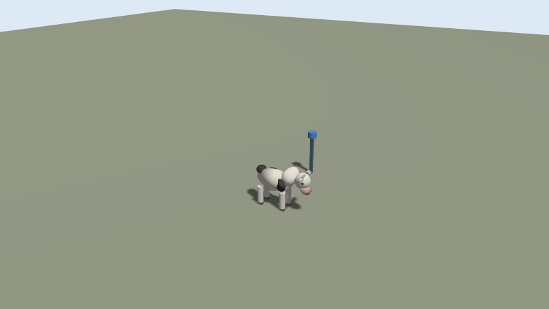
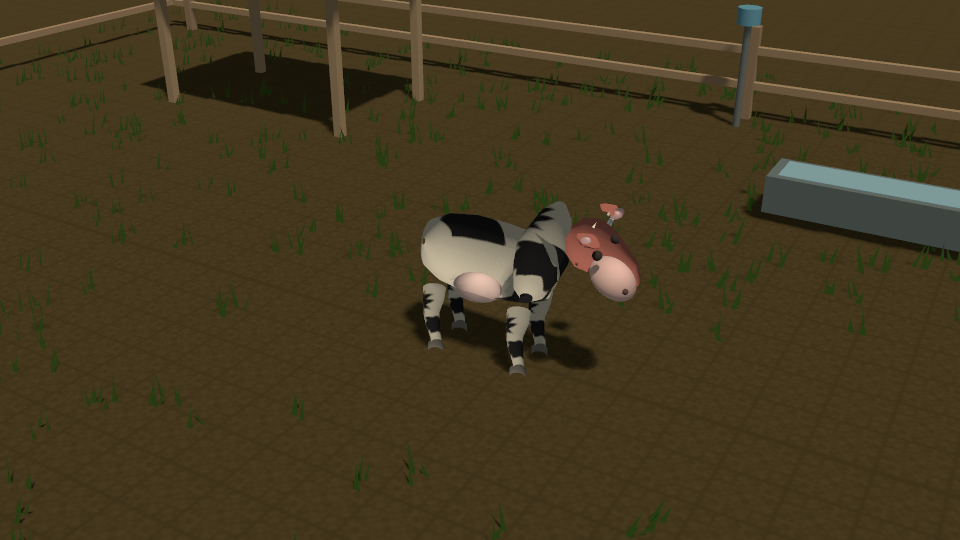
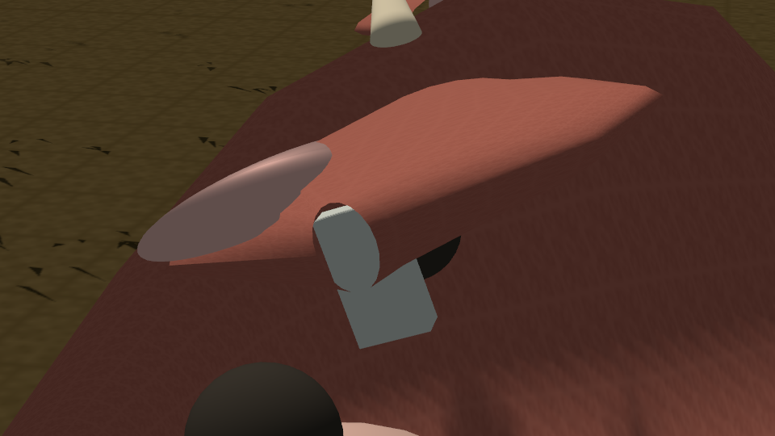

# RIOSE MVP3 visual digital twin — report

**Date:** 2026-10-05
**Runtime:** Gazebo Sim 8.15 / Harmonic, OGRE2; firmware remains in Zephyr/C on Renode.
**Status:** Phases A, B and C have implementation and runtime evidence. The simulation is deterministic and stylized, not a photoreal or veterinary-grade animal model.

## Before vs. after

| Before | After |
|---|---|
| Placeholder body made from simple primitives on an empty, gridded floor. | Procedural bovine lofts with coat maps, articulated neck/head/ears, tapering leg and hoof meshes, PBR materials, bounded paddock, grass, fence, shelter, trough, receiver anchor, sky and shadows. |
| No product camera sequence or saved visual record. | Six OGRE2 camera feeds, a product macro, overview, per-camera clips, synchronized timeline, TX event marker and composite cinematic. |







These are real Gazebo OGRE2 captures. The after image is a deliberately compact, low-detail procedural animal; it is materially more structured and readable than the baseline, but should not be presented as photorealistic.

## Asset provenance

- The cow, ground, grass and texture maps are generated by `scripts/build_mvp3_visual_assets.py`, authored by RIOSE project contributors. No third-party mesh or texture was imported. The checkout has no standalone SPDX license file, so the generated assets have no separately asserted license.
- The tag enclosure mesh is regenerated from the existing MVP2 CadQuery source and `results/mvp2/mechanical/geometry.json`. No new generic tag geometry was substituted. The MVP2 dimensions and several mass/dynamic values remain `ASSUMED`; the STL has no UV coordinates, so its visual material uses an explicit PBR base color and scalar roughness.
- Exact references, authorship and modifications are recorded in [`ASSET_PROVENANCE.md`](../src/riose/products/ear_tag/mvp3/gazebo/models/ASSET_PROVENANCE.md) and the generated geometry provenance file.

## Phase A — functional realism

### Changes

- Replaced the placeholder animal with separate `body`, `neck`, `head`, `ear_left` and `ear_right` links. The head, ears and four leg/hoof visuals are independent; the leg shapes are procedural loft meshes. Contact collision and stable physical proxies remain separate from those visuals.
- Added revolute ear joints, a fixed stud and a revolute tag attachment. `src/riose/products/ear_tag/mvp3/tag_attachment.yaml` records attachment position, rotation, mass, pivot, damping, stiffness and angle limits; values without validated project measurements are marked `ASSUMED`.
- The tag uses the MVP2-derived STL and project mass estimate, not a newly invented enclosure. Tag inertia remains the documented envelope approximation because the source does not supply a validated tensor.
- Replaced pose jumps with time-interpolated joint trajectories for standing, walking, running, head shake, ear flick, lower head and raise head.

### Physics and measurements

- Gazebo physics uses gravity `-9.81 m/s²`, a `0.001 s` maximum step and existing stable contact geometry. Ear/tag pivot drift stayed below the `0.005 m` gate tolerance in all four recorded scenarios.
- Phase A evidence is in `results/mvp3/media/evidence/phase-a-gate.json`; compact evidence snapshots are committed with the report.

| Scenario | IMU samples | Max pivot drift | Max relative hinge angle |
|---|---:|---:|---:|
| Standing | 156 | 0.00117 m | 0.0400 rad |
| Walking | 234 | 0.00161 m | 0.0553 rad |
| Running | 156 | 0.00210 m | 0.0720 rad |
| Head shake | 130 | 0.00178 m | 0.0610 rad |

`PHASE_A_FUNCTIONAL_REALISM_PASS` is based on these scenario records and the separate live integration record: 801 Gazebo IMU samples reached Renode at matching simulation-time barriers, the firmware returned to `SLEEP`, and 3 TX_DONE events included 2 movement-derived transmissions. No activity label was sent to firmware. Accelerometer and angular velocity originate from the Gazebo IMU; firmware wake behavior is marked `SIMULATED_APPROXIMATE_HIGH_PASS_WU`.

**Limits:** Gazebo did not provide parseable ear/tag contact-wrench messages in these runs; attachment force values are `UNAVAILABLE`, not measured. Tag mass/inertia and attachment spring/damping remain assumptions. Scenario gates prove the model remains attached and responds, not biological accuracy.

## Phase B — visual realism

### Materials, lighting and environment

- OGRE2 uses generated bovine albedo, normal and roughness maps; the MVP2 STL receives a slate polymer PBR base color with scalar roughness because it has no UV coordinates. The stud remains a separate metal visual.
- Replaced the rendered checkerboard floor with a soil material mesh while retaining the broad collision plane. Added seeded, batched grass, perimeter timber fence, shelter, feeding/water trough and the existing receiver anchor.
- Configured a directional late-afternoon sun, ambient/background sky, native sky component and shadows. No third-party HDRI was needed.
- The presentation world contains overview, follow, head, ear-tag macro, anchor and ground-low cameras. The preset changes camera capture quality only; it does not change physics. Headless noncapture runs disable visual sensors for resource efficiency.

### Evidence and gate

`results/mvp3/media/evidence/phase-b-gate.json` records six OGRE2 camera streams with 204 frames each in the default PRESENTATION preset, the six-camera rig, PBR assets, the actual before/after captures and the product close-up. It reports `PHASE_B_VISUAL_REALISM_PASS` for this compact stylized target. The macro is a technical product view, not a photoreal render.

## Phase C — presentation

### Cinematic and replay

- `scripts/run_mvp3_cinematic.sh` builds/uses the existing Zephyr/Renode ELF and calls the MVP3 cinematic command. It captures overview, walking, head, tag, anchor and low-ground camera streams with Gazebo simulation timestamps.
- The composite has seven cuts: paddock overview, walking, head/ear response, tag macro, slow-motion head shake, logical TX event, and product telemetry. `--slow-motion` accepts `1x`, `0.5x` or `0.25x`; the timeline retains each source simulation timestamp even when presentation frames are duplicated.
- The TX connector is explicitly labeled **EVENT VISUALIZATION · NOT RF PROPAGATION**. RSSI and SNR are `UNAVAILABLE`; the backend label is the Renode SX1262 logical model.
- The product shot carries a compact firmware state, activity estimate, radio state, IMU count, TX_DONE count, last packet tag/sequence, simulated rail voltage and assumed TX energy. `--no-overlay` removes the telemetry text; the RF event disclaimer remains visible with the event marker.
- Presentation replay is available as `riose mvp3 replay <experiment> --presentation --slow-motion 0.25` and reuses saved camera frames rather than rerunning physics.

### Live telemetry and artifacts

The final captured experiment snapshot is committed in `results/mvp3/media/evidence/summary.json`, `manifest.json` and `firmware_live_evidence.json`: 851 Gazebo IMU samples injected, 44 firmware sample reads, 3 TX_DONE, 1 movement-derived TX, and final firmware state `SLEEP`. Its `summary.json` reports `MVP3_DIGITAL_INTEGRATION_PASSED` (11/11). The live chain stays Gazebo → IMU → bridge → LIS2DW12 model → Renode → unchanged Zephyr firmware → SX1262 logical model. TX energy and the MVP2 power summary are `ASSUMED`/`SIMULATED`, not measurements. The initial cinematic attempt with the default ELF failed to advance beyond BOOT; a larger stack/heap build configuration fixed the runtime, and the corrected live capture passed the integration gate.

Public media is saved under `results/mvp3/media/`:

- `before.png`, `overview.png`, `ear_tag_closeup.png`
- `walking.mp4`, `head_shake.mp4`, `rf_event.mp4`, `cinematic.mp4`
- Per-camera MP4, timestamp CSV, `capture_manifest.json` and `cinematic_timeline.json` are kept with each experiment; the final capture manifest and cinematic timeline are included in the compact evidence snapshot.

The final video uses OpenCV MP4V because the installed ffmpeg executable crashes in this environment. The video is encoded from actual Gazebo camera frames; no synthetic render frames are used.

## Reproduction commands

```bash
scripts/setup_mvp3_visual.sh
scripts/run_mvp3.sh mixed --visual
scripts/run_mvp3_headless.sh mixed
scripts/run_mvp3_cinematic.sh --quality high --slow-motion 0.5
riose mvp3 camera ear-tag --quality high
riose mvp3 replay results/mvp3/<experiment> --presentation --slow-motion 0.25
```

Both cinematic entry points auto-build a Zephyr/Renode ELF into `/tmp` if `RIOSE_ZEPHYR_ELF` is not already set. The helper uses the existing MVP2 toolchain and adds only a temporary Zephyr stack/heap config needed for the Renode profile.

## Verification and limitations

- `python3 scripts/check_mvp3_phase_a.py results/mvp3/phase_a_validation_20261005/final`: `PHASE_A_FUNCTIONAL_REALISM_PASS`.
- `python3 scripts/check_mvp3_phase_b.py results/mvp3/cinematic-20261005T165530Z`: `PHASE_B_VISUAL_REALISM_PASS` after the final capture.
- `uv run --extra dev pytest -q tests/ear_tag/test_mvp3_*.py`: 91 passed on the rebased branch, including the visualization tests from the existing production pass.
- `scripts/run_mvp3_headless.sh walking --duration-s 2 --output results/mvp3/final_headless_smoke_20261005`: live two-second Gazebo headless smoke completed.
- `uv run --project . riose mvp3 run mixed --visual --duration-s 2 --output results/mvp3/final_visual_smoke_retry1_20261005`: live GUI smoke completed after fixing copied-world mesh URIs. The first attempt logged a missing grass OBJ because model:// mesh references resolved relative to the copied experiment world; `_scenario_world` now rewrites only those world mesh/texture paths to the copied experiment assets. The retry log has no mesh-load errors.
- `env -u RIOSE_ZEPHYR_ELF scripts/build_mvp3_renode_firmware.sh`: built the Zephyr/Renode ELF into `/tmp` successfully; `riose mvp3 cinematic` uses this helper automatically when the variable is unset.
- `scripts/test_mvp3.sh --quick` runs the existing quick suite but reports `PARTIAL`, because its live Gazebo check is intentionally skipped; do not interpret it as a live integration pass. Live integration is evidenced separately by the cinematic record.
- Motion remains a deterministic approximation; the final mixed cinematic's measured animal-root displacement was `0.807 m` against `4.0 m` requested. Contact forces and RF RSSI/SNR are unavailable. The cow remains stylized and the power model remains assumption-based.
