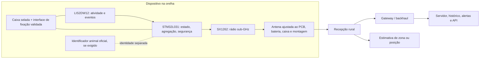

# Pesquisa de arquitetura e materiais — ear tag RIOSE

**Estado:** pesquisa técnica inicial; nenhum material, rádio, bateria ou desenho físico está liberado para fabricação. Este documento separa evidência publicada, dados de fabricante e inferências de engenharia.

## Síntese executiva

1. O produto deve separar **identificação oficial do animal** de **telemetria ativa**. O SX1262 a 915 MHz não substitui, por si só, um transponder de identificação animal conforme o regime aplicável. O MAPA mantém SISBOV e está implementando o plano PNIB 2025–2032; o país de lançamento e o papel legal do produto precisam ser decididos antes do desenho final. [MAPA — PNIB](https://www.gov.br/agricultura/pt-br/assuntos/sanidade-animal-e-vegetal/saude-animal/rastreabilidade-animal/pnib), [MAPA — legislação e SISBOV](https://www.gov.br/agricultura/pt-br/assuntos/sanidade-animal-e-vegetal/saude-animal/rastreabilidade-animal/legislacao-e-normas), [ISO 11784:2024](https://www.iso.org/standard/83944.html), [ISO 11785:2026](https://www.iso.org/standard/91012.html).
2. **O encaixe simulado agora passa, mas ainda não foi validado fisicamente.** A ficha registra a TLL-5902 como Ø14,5 × 25,2 mm segundo o desenho do fabricante; o candidato separa PCB e bateria em bays, assume 18,5 mm de profundidade e verifica 0,5 mm de folga e interferência do furo. A caixa, terminais, tolerâncias, vedação, retenção e montagem continuam sem desenho revisado ou ensaio físico. [Spec atual](../../hardware/spec.yaml), [relatório mecânico](../../results/mvp2/mechanical/geometry.json), [catálogo Tadiran](https://tadiranbat.com/products/ixtra-series-lithium-thionyl-chloride-lisocl2-batteries/).
3. **A antena de 915 MHz ainda é hipótese paramétrica.** O arquivo assume FR-4 genérico, cobre ideal, bloco condutor para a bateria, dielétrico TPU não caracterizado e phantom animal homogêneo. No fluxo integrado, apenas o cenário com caixa passou a comparação de duas malhas; espaço livre e PCB falharam convergência, bateria não atingiu o critério de energia e animal não teve ressonância bracketed. Nenhum resultado comprova desempenho físico. Congelar stackup, geometria e resina reais antes de otimizar; medir com VNA e ensaiar montada perto da orelha. [Modelo atual](../../hardware/antenna/candidate_model.json), [relatório integrado](../../docs/mvp2-digital-twin-report.md), [piloto histórico](../../results/mvp2/antenna/openems_candidate_pilot.json).
4. **A TLL-5902 não está validada para o perfil do rádio.** Sua capacidade nominal de 1,1 Ah é a 1 mA até 2 V; a folha também mostra cerca de 0,8 Ah a 14 mA em temperatura ambiente. O gráfico de resposta após armazenamento usa pulsos de 10 mA/100 ms, enquanto o modelo de rádio usa um ponto de estresse de 45 mA a +14 dBm. Isso não é evidência para pulsos repetidos, frio, envelhecimento, placa e regulador RIOSE. [Datasheet TLL-5902](https://tadiranbat.com/wp-content/uploads/2022/03/tll-5902.pdf), [pesquisa sobre impedância e passivação Li-SOCl₂](https://doi.org/10.1016/j.electacta.2019.135584).
5. **O firmware deve escolher um protocolo.** LoRa é a camada física do SX1262; LoRaWAN adiciona MAC, canais regionais, segurança e janelas de recepção. A janela atual do protótipo (100 ms após TX) não implementa as janelas Class A do LoRaWAN. Escolher explicitamente entre LoRa ponto a ponto com rede RIOSE e LoRaWAN completo; depois recalcular autonomia e gateway para esse protocolo. [LoRaWAN Link Layer 1.0.4](https://lora-alliance.org/wp-content/uploads/2021/11/LoRaWAN-Link-Layer-Specification-v1.0.4.pdf), [LoRa Alliance RP002-1.0.4](https://resources.lora-alliance.org/home/rp002-1-0-4-regional-parameters).
6. Há suporte científico para usar acelerometria de ear tag como **indicador de atividade**, mas não para reivindicar classificação comportamental clínica sem dados RIOSE. O LIS2DW12 pode coletar em baixa potência; validação exige rótulos observados e separação de animais entre treino e teste. [Hu et al., 2024](https://doi.org/10.3390/ani14020301), [Rahman et al., 2018](https://doi.org/10.1016/j.inpa.2017.10.001).

## Arquitetura candidata

Esta é uma arquitetura para prototipar e medir, não uma especificação liberada:

- Se a função inicial for **presença em zona ou alerta de cobertura**, um conjunto de receptores/anchors fixos pode registrar RSSI, SNR, canal, data rate e horário de cada pacote. Isso não equivale automaticamente a uma posição métrica. Para posicionamento por RSSI, validar calibração local e erro; TDoA exigiria sincronismo real dos receptores. Estudos de LoRa em pecuária mostram viabilidade de comunicação em pasto, mas não validam a antena ou a precisão RIOSE. [Reis et al., 2021](https://doi.org/10.1093/tas/txab010), [Dieng et al., 2019 — RSSI dinâmico](https://datad.aau.org/items/5cf166af-89d8-4227-8cd2-f1cf7a20507d).
- Se o produto adotar **LoRaWAN**, usar gateways/concentradores e servidor de rede compatíveis com o plano regional. Se adotar **LoRa proprietário**, implementar e documentar protocolo, autenticação, replay protection, endereçamento, atualizações, agendamento, colisões e comportamento do gateway. Não chamar uma rede LoRa própria de LoRaWAN.
- No Brasil, 915–928 MHz aparece nos requisitos da Anatel para radiação restrita, sob limites e requisitos técnicos aplicáveis. Isso não torna automaticamente conforme qualquer placa em 915 MHz; produtos de telecomunicações exigem avaliação/homologação para comercialização e uso, conforme categoria e procedimento. A versão corrente do Ato nº 14.448 deve ser usada no projeto de conformidade. [Ato Anatel nº 14.448](https://informacoes.anatel.gov.br/legislacao/atos-de-certificacao-de-produtos/2017/1139-ato-14451), [Resolução Anatel nº 715/2019](https://informacoes.anatel.gov.br/legislacao/resolucoes/2019/1350-resolucao-715), [Anatel — homologação e espectro](https://www.gov.br/anatel/pt-br/regulado/espectro).
- Manter separados no software: identidade de negócio do animal, identificador de rádio e código de eventual transponder oficial. A integração legal com PNIB/SISBOV e os formatos ISO/ICAR requer confirmação com MAPA e laboratório/organismo aplicável; o rádio ativo não recebe esse status só por estar instalado em um brinco.

## Materiais, forma e bem-estar

### Evidência

- Um estudo de 2025 comparou protótipos de ear tag para vedação virtual. Na avaliação de campo de 30 dias, os protótipos menores e mais leves em Nylon 6/66 retiveram-se melhor que as caixas de resina, mas material, forma e massa mudaram ao mesmo tempo; a amostra foi pequena e não demonstra a vida útil de uma peça RIOSE. [James et al., 2025, *Frontiers in Animal Science*](https://doi.org/10.3389/fanim.2025.1643958).
- Um estudo de smart ear tags em bezerros investigou material, forma, massa e posição juntos; reporta um candidato de cerca de 20 g em PC-ABS/TPE, colocado no terço interno da orelha, com menor queda da orelha e melhor retenção naquele estudo. Isso é um ponto de partida experimental específico, não uma regra universal: raça, idade, montagem, ambiente e geometria mudam o resultado. [Estudo de 2025 sobre material, forma, massa e posição](https://www.sciencedirect.com/science/article/pii/S1871141325002197).
- Lesões e retenção dependem de mais que polímero. Em 802 bezerros de 42 fazendas, estudo observacional encontrou lesões leves/severas e risco associado ao posicionamento sobre cristas cartilaginosas. Uma comparação mais antiga encontrou menos dano com etiquetas de poliuretano que com metal, mas não prova a adequação de qualquer TPU atual ou da caixa eletrônica. [Hayer et al., 2022](https://pubmed.ncbi.nlm.nih.gov/35121288/), [Johnston & Edwards, 1996](https://doi.org/10.1136/vr.138.25.612).
- O ICAR oferece protocolos concretos para etiquetas convencionais: cantos lisos, peso/forma/fechamento, composição e substâncias nocivas, envelhecimento, abrasão, impacto, condições frias/quentes e força de ruptura. Aplicabilidade e limiares dependem de a RIOSE ser uma etiqueta oficial de identificação ou um acessório de manejo. Os métodos servem como referência enquanto essa categoria é decidida. [ICAR — certificação e procedimentos](https://www.icar.org/certifications/animal-identification-devices/certification-procedures/), [ICAR — ensaio B5, versão 2024](https://www.icar.org/Guidelines/10-Appendix-B5-Laboratory-Test-for-Conventional-Plastic-Ear-Tags.pdf).

### Triagem de candidatos

| Subconjunto | Candidato para comparar | Justificativa e ressalva |
|---|---|---|
| Carcaça estrutural | PA12 estabilizado a UV versus PP de impacto estabilizado a UV; incluir PC-ABS se massa/forma do artigo 2025 for compatível | Comparar peças do processo real. A evidência de Nylon 6/66 impresso não define propriedades de PA12 ou PP injetado. |
| Superfície flexível | TPU/TPE como zona de contato ou amortecimento, separada da carcaça | Não selecionar uma família sem ficha da formulação, dureza, resistência química, envelhecimento e ensaio de interface. A permissividade atual do TPU é apenas placeholder. |
| Fixação | Preservar uma etiqueta/pino conhecido e evitar nova perfuração até revisão veterinária | Reduz risco de criar um método de fixação com carga, ferida e retenção sem evidência. Medir alavanca, massa, snagging e distribuição de carga. |
| Vedação | Caixa selada sem manutenção versus junta substituível | Escolher processo (solda ou junta) conforme resina, bateria e serviço; testar o conjunto acabado. Uma classe IP escolhida no papel não substitui ensaio após envelhecimento. |

Normas como métodos de ensaio a considerar após definir exposição real: [ISO 4892-3:2024, exposição UV de plásticos](https://www.iso.org/standard/83802.html), [ISO 175, resistência a líquidos químicos](https://www.iso.org/standard/55483.html), [ISO 4611, calor úmido/água](https://www.iso.org/standard/54099.html), [ISO 527-1, tração](https://www.iso.org/standard/527-1) e [IEC 60529, graus IP](https://webstore.iec.ch/en/publication/2452). Usar cada método só se ele corresponder à lama, chuva, lavagem, desinfetante e vida de campo definidos.

## RF, antena e localização

- A candidata atual tem caminho de traço paramétrico de 82 mm, PCB assumido de 30 × 48 mm, plano de terra PEC, FR-4 genérico e caixa/phantom assumidos. O relatório OpenEMS declara falha de convergência em vários casos; ressonâncias e eficiências exploratórias são resultados numéricos não aceitos, não medições. O parâmetro `S11 < -10 dB` isolado não prova eficiência, alcance nem padrão de radiação.
- Antenas de dispositivos próximos ao corpo sofrem carga dielétrica, absorção e detuning; artigo de antena vestível medida em 915 MHz alcançou ganho e eficiência diferentes nos casos on-body/off-body, mostrando por que medir só em espaço livre não basta. [Biosymbiotic 3-D-Printed PIFA, IEEE TAP 2024, DOI 10.1109/TAP.2023.3331764](https://doi.org/10.1109/TAP.2023.3331764).
- Pesquisa com orelhas bovinas e suínas em etiquetas UHF passivas mostra que a orelha altera RSSI e alcance; é pertinente para justificar teste com phantom e animal, mas a tecnologia e a antena não são iguais ao LoRa ativo RIOSE. [Adrion et al., 2017](https://www.sciencedirect.com/science/article/pii/S0168169917300145).
- Antes de otimizar, congelar: país/banda, modo de rede, tamanho e frequência de pacotes, potência permitida, plano do PCB, tipo/altura da bateria correta, stackup (laminado, espessura, cobre, máscara), geometria da caixa e distância/orientação em relação à orelha. Fazer sequência VNA/S11 e impedância na placa, conjunto real, phantom documentado e montagem em campo; depois medir eficiência/padrão, potência irradiada, PER, RSSI/SNR e cobertura.
- Uma antena multibanda ou tolerante a detuning pode ajudar mecanicamente, mas pode cobrar área/eficiência. Não selecionar solução sem mapear ganho, eficiência, cobertura angular, folga de montagem e consumo versus custo/área.

## Energia, sensores e firmware

- A TLL-5902 publica 3,6 V, 1,1 Ah a descarga contínua de 1 mA até 2 V, 50 mA contínuos recomendados, 100 mA de capacidade máxima de pulso e faixa térmica ampla; o gráfico pós-armazenamento é uma condição de 10 mA por 100 ms à temperatura ambiente. A capacidade disponível cai com perfil/corrente/temperatura. Não usar `capacidade nominal / corrente média simulada` como autonomia do produto. [Datasheet TLL-5902](https://tadiranbat.com/wp-content/uploads/2022/03/tll-5902.pdf), [catálogo do fabricante com dimensões e tamanhos](https://tadiranbat.com/products/ixtra-series-lithium-thionyl-chloride-lisocl2-batteries/).
- O SX1262 publica RX em torno de 4,6 mA e correntes TX dependentes da potência/configuração. O valor de 45 mA citado no repositório é um ponto de estresse de +14 dBm, não a corrente medida da placa a +10 dBm. Incluir PA, chave RF, regulador, duração de airtime por SF/BW/tamanho, janelas de RX, retries e boot. [Semtech SX1262](https://www.semtech.com/products/wireless-rf/lora-connect/sx1262).
- Estudos eletroquímicos mostram crescimento de impedância/passivação e atraso de tensão em células Li-SOCl₂ após repouso; capacitor de buffer é um caminho a testar, não um valor que possa ser copiado sem onda de carga da placa. [Zabara & Ulgut, 2020](https://doi.org/10.1016/j.electacta.2019.135584), [Chung, Lee & Ko, 2005](https://doi.org/10.1016/j.jpowsour.2004.08.043).
- O sensor atual LIS2DW12 suporta FIFO, wake-up e detecção de atividade. Datasheet indica cerca de 0,38 µA a 1,6 Hz e 1 µA típico a 12,5 Hz em modo de baixa potência; o `hardware/spec.yaml` assume 0,8 µA. Corrigir o modelo para o ODR e configuração escolhidos e somar a corrente real da placa. [ST LIS2DW12](https://www.st.com/resource/en/datasheet/lis2dw12.pdf), [nota AN5038 sobre always-on e wake-up](https://www.st.com/resource/en/application_note/an5038-lis2dw12-alwayson-3axis-accelerometer-stmicroelectronics.pdf).
- O STM32L031K6 oferece 8 KB RAM e 32 KB flash segundo datasheet. Isso favorece agregação simples e armazenamento compacto antes de rádio; classificação mais rica deve ser dimensionada e validada com orçamento de memória/energia em firmware. Não inferir desempenho de classificação animal a partir de recursos do chip. [ST STM32L031K6](https://www.st.com/resource/en/datasheet/stm32l031k6.pdf).
- Para validar o rádio: capturar simultaneamente corrente da célula, tensão da célula e tensão 3,3 V em start/TX/RX; repetir com célula nova, armazenada e em frio. Registrar resets, brownout, retransmissão, perfil SF/BW/payload e sucesso de pacote. Para atividade, usar rótulos observados e teste com animais inteiros fora do treino. [Hu et al., 2024](https://doi.org/10.3390/ani14020301), [Rahman et al., 2018](https://doi.org/10.1016/j.inpa.2017.10.001).
- Verificar transporte e segurança com o sufixo exato de terminal e a bateria no equipamento final; resumo UN 38.3 de uma célula não encerra a avaliação de embalagem, curto-circuito, corrosão, serviço e descarte do produto. [Tadiran — relatórios UN 38.3](https://tadiranbat.com/technical-data/un-38-3-test-summary-reports/).

## Plano de validação por gates

1. **Definição do produto:** escolher país/mercado, função oficial versus acessório de manejo, cria/adulto, pasto/estábulo, vida útil, intervalo/latência, cobertura, precisão requerida, massa máxima e política de manutenção.
2. **Fechamento de BOM e volume:** confirmar a célula e suas terminações na BOM; revisar o novo envelope/posicionamento assumido em desenho mecânico; emitir massa/CdG com material real e tolerâncias; revisar instalação com veterinário e produtor.
3. **Banco mecânico e material:** fabricar amostras dos candidatos no processo previsto; medir massa, encaixe, tração/flexão/impacto, fadiga da montagem e abertura; repetir após UV, água/calor/frio, lama e químicos de limpeza escolhidos. Observar arranhões, bordas, desprendimento e ingresso.
4. **Banco RF:** placa em VNA; caracterizar bateria/resina/PCB; medir detuning nas posições/orientações previstas, phantom com propriedades identificadas e montagem real sob protocolo ético; registrar S11, eficiência, padrão, potência e sensibilidade.
5. **Banco elétrico:** perfis temporais de consumo; baixa temperatura, armazenamento/passivação, pulse sag, startup, regulator dropout, brownout, reset e recuperação; comparar capacitor ou célula alternativa apenas com dados.
6. **Campo de rede/localização:** paddock medido, animais agrupados e separados, alturas e espaçamentos de anchors, vegetação/cercas, perda de pacote e horários. Publicar separadamente cobertura/entrega e erro de localização P50/P95.
7. **Bem-estar, segurança e conformidade:** teste animal só depois de protótipos de bancada, revisão veterinária e aprovação ética pertinente; definir protocolo de lesão/conforto/retenção e critérios de remoção. Consultar MAPA/Anatel/laboratórios para classificar o produto e o processo antes de alegações comerciais.

## Decisões ainda abertas

- Brasil como primeiro mercado ou lançamento multirregional?
- A tag será identificador oficial, dispositivo de manejo ou ambos por meio de dois identificadores?
- O caso de uso requer detecção de zona, posição aproximada ou coordenada métrica?
- Usaremos LoRaWAN, com gateway e servidor de rede, ou protocolo RIOSE ponto a ponto?
- Quantas horas/dias de latência, cobertura, tamanho de rebanho, anchors e vida útil são necessários?
- A unidade comprada será mesmo TLL-5902 e qual será sua terminação? As dimensões estão reconciliadas; a seleção de BOM e o encaixe físico ainda não foram aprovados.
- O tag ficará preso por etiqueta aprovada existente, adaptação a botão, ou conjunto novo? Qual é o limite de massa e braço de alavanca aceitável?
- Qual procedimento do MAPA/ICAR e da Anatel aplica à primeira classe de produto?

## Fontes de pesquisa e qualidade

- **Pesquisa revisada por pares:** papers de wearables/atividade, RF e materiais citados ao longo do texto. Estudos com amostra pequena/curta são tratados como hipótese de projeto, não como garantia.
- **Normas e reguladores:** ISO, ICAR, Anatel e MAPA são fontes primárias para escopo e procedimento. A versão aplicável deve ser confirmada na fase de conformidade.
- **Datasheets:** ST, Semtech, TI e Tadiran definem limites do componente sob condições especificadas; não substituem caracterização da placa/célula final.
- **Ferramenta de pesquisa:** não havia CLI/MCP Firecrawl disponível neste ambiente; a coleta foi feita por busca web, consulta direta a páginas oficiais e periódicos, e expansão manual por referências/temas adjacentes. Próxima revisão pode ampliar a bibliografia usando IDs de papers e busca semântica quando o indexador estiver disponível.

**Prompt de retomada do objetivo:** aprofundar as fontes e as decisões abertas acima, levantar stacks e materiais de fabricação disponíveis no Brasil, transformar critérios de aceitação em protocolo quantitativo e atualizar a arquitetura somente depois de cada número possuir uma fonte ou uma medição identificada.
